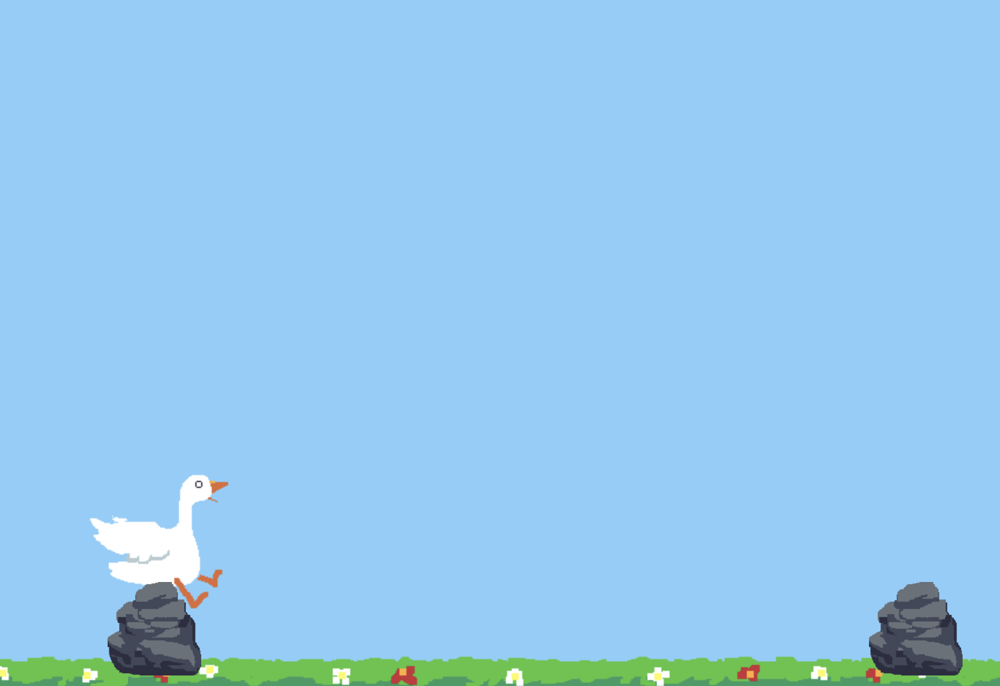
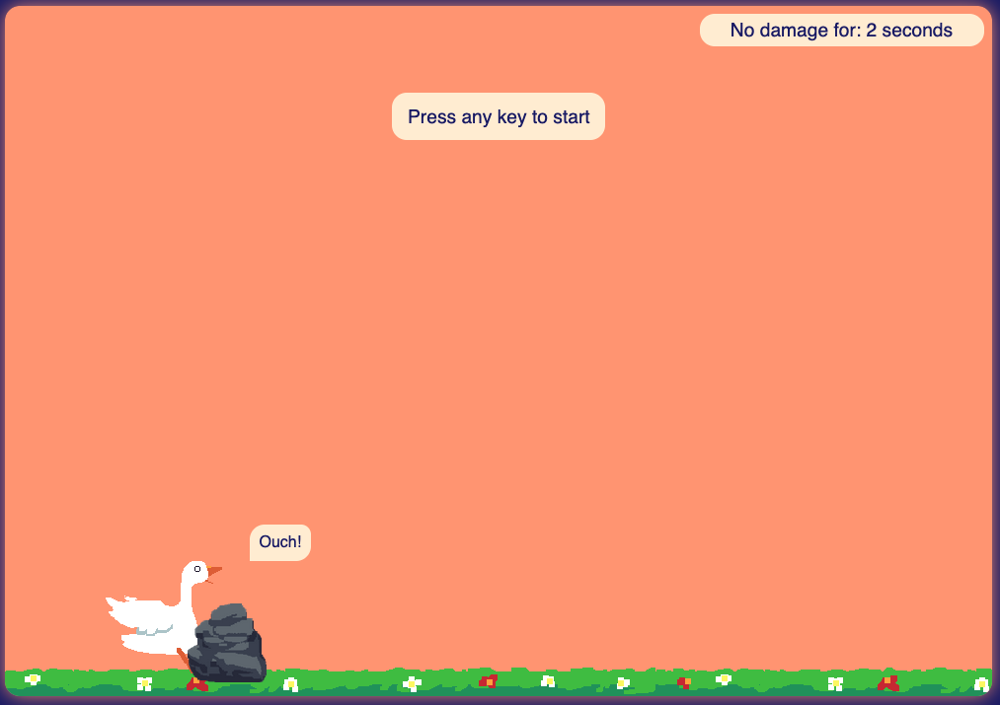

# Wildflower Odyssey - Endless Escape

Welcome to the **Wildflower Odyssey - Endless Escape game**! 🎉 We worked on our newest endless runner game and we need your help to finish it. 🙏

## What is an Endless Runner Game?

An **endless runner game** is a type of video game where the player character is constantly moving forward through a theoretically endless game world. The **goal** is to **avoid the obstacles** and to **survive as long as possible**.

### How to Play the Game?

- The player can **start the game** by pressing any key.
- The player can **control the avatar** by pressing the `space` key to jump.
- The **game is over** when the player hits an obstacle.
- The player can **restart the game** by pressing the any key.

### Project Setup

We have already created the project for you and used **HTML**, **CSS** and **JavaScript** to make the game work.

#### What is HTML?

**HTML (Hyper Text Markup Language)** is used to express text in a structured way. **HTML tags** indicate what kind of element is displayed on the website.

#### What is CSS?

**CSS (Cascading Style Sheets)** is used to style the HTML elements. We will use CSS to make our game look nice. Most of the stylings are already done for you, but you can change some of the colors of the game if you want to. We will show you how to do this later and we will do this by using JavaScript. 🤓

#### What is JavaScript?

**JavaScript** is used to make our game interactive. Some examples:

- We use JavaScript to add the player and the obstacles to our game.
- We use JavaScript to make the player jump and to make the obstacles and the grounds move.
- We also use JavaScript to make the game more challenging by increasing the speed of the game over time.
- And we use JavaScript to update the score of the player.

These functionalities are already implemented for you, but we need to write the correct HTML to make the JavaScript code work. And we also need to decide on some configurations for our game that we also need to write in JavaScript.

## Help to Build an Endless Runner Game

Almost everything has been done for you: The game setup and the game logic is implemented and also the general stylings are finished. **But** we need your help with writing the correct structure for our game and we also need to decide on some configurations for our game. _Let us begin!_ 🚀

**Note:** As we have created much of the game logic and styling beforehand, we need to be precise with the code we are writing. Please follow our instructions carefully and do not change the existing code (unless we say to do so). If you have any questions, please ask your coaches. **But** feel free to adjust the code **after** we have finished the game. 🤓

### Steps

### 1 - Create the World

The first thing we need to do is to create the **world**. The world is the `main` container for our game. It is the place where the player and the obstacles are placed.

To add the world to our project we write **HTML code**. We need to create a `main` element and add two attributes to our element: `class` and `data-js`:

```html
<main class="world" data-js="world"></main>
```

We add the correct attributes to add some more information for each element in order to work properly. This information is specified via **attributes**, which are added to the opening tag of an element. Attributes are made up of two parts: a **name** and a **value**, separated by an equals sign (`=`). The value should be wrapped in quotes (`""`). In our case we use the `class` and the `data-js` attribute:

- The `class` attribute is used to specify one or more class names for an element. We will use this attribute to style elements with CSS. The value depends on the element. For the `main` element we decided to work with the class name `world`.
- The `data-js` attribute is used to specify the JavaScript code for the element. We will use this attribute to select elements in our JavaScript code. For our `main` element we decided to work with the value `world`.

#### Result:

**Note:** After saving the file, you should see a blue box. This is the world we just created. 🌍

### 2 - Add the Ground(s)

Now that we have created the world, we want to add the ground(s) to our game. The ground is the place where the player is running on. We need to add two grounds to our game. We do this by writing **HTML code**. We need to create two `div` elements and add two attributes to each element: `class` and `data-js`:

```html
<main class="world" data-js="world">
  <div class="ground" data-js="ground"></div>
  <div class="ground" data-js="ground"></div>
</main>
```

- A `div` element is a generic container.
- `div` elements are versatile and can be used for lots of different things.
- We use `div` elements to create the ground(s) for our game.
- We use the `class` and the `data-js` attribute for the same reason as we did for the `main` element.

#### Why do we need two grounds?

**Explanation:** It may seem strange that we add two grounds to our game. But we need to do this because we want to create the illusion that the player is running. We do this by moving the grounds from right to left. When the first ground is out of the screen, we move it back to the right side of the screen. This way it looks like the player is running (The player still needs to be implemented at this point). 🏃‍♀️

#### Result:

After saving the file, you should see at the bottom of our world a wildflower field. 🌼

<p align="center">

</p>

### 3 - Add the Player

As there is now not only a world but also a ground, we can add the player to our game. The player is the runner in our game that the player controls. **First** we need to add the player to our HTML code. We need to create a `div` element and add two **attributes** to the element: `class` and `data-js`:

```html
<div class="player" data-js="player"></div>
```

**Now** we need to add the image of the player to our HTML code. We need to create an `img` element and add three **attributes** to the element: `data-js`, `src` and `alt`:

```html
<div class="player" data-js="player">
  
</div>
```

- An `img` element is used to embed an image in an HTML page. This element is used to display the **image of the player**. 🏃‍♀️
- The `src` attribute specifies the path to the image.
- The `alt` attribute provides an alternate text for an image.
- The `alt` attribute is important for accessibility reasons. It is used to describe the image to people who are visually impaired.
- We use the `data-js` attribute for the same reason as we did for the `main` element.
- The **image of the player** is placed inside the `div` element.

It is up to you to decide which runner you want to use for the player. We have added some options for you. You can find them in the `assets` folder. You can choose between the following runners:

- **Gwendolyn the Graceful Goose** (`src="./assets/gw_1.png"`)
- **Fabius the Fabulous** (`src="./assets/fw_1.png"`)
- **Astralina the Starlight** (`src="./assets/sw_1.png"`)

<p align="center">

</p>

#### Why do we need two elements for the player?

**Explanation:** For the player we need two elements. The first element is the `div` element. This element is used to position the image of the player correctly. The second element is the `img` element. The player image **won't** stay the same during the game. The player will **run, jump and lose**. For all these states of the player we have different images. We will change the image of the player during the game. Therefore, we need a container element that handles the positioning of the player character and to which we can relate the image of the player.

#### Result:

We can now see the player in our game. 🎉 And the player can jump, but the runner does not change the image yet. We will change this next! 💪

<p align="center">

</p>

### 4 - Configure the Player

Now that we have added the player to our game, we need to configure the player. We do this by writing some **JavaScript code** inside of our `setup.js` file. In this file we need to create a **constant** called `player` and export it. We need to add the following **properties** to our `player` object:

```js
export const player = {
  run1: "/assets/gw_1.png",
  run2: "/assets/gw_2.png",
  jumping: "/assets/gj.png",
  lose: "/assets/gh.png",
  rotate: true,
};
```

- The `run1` property is used to specify the path to the first image of the player.
- The `run2` property is used to specify the path to the second image of the player.
- The `jumping` property is used to specify the path to the jumping image of the player.
- The `lose` property is used to specify the path to the lose image of the player.
- The `rotate` property is used to specify if the player should rotate when jumping. We set this property to `true` because we want the player to rotate when jumping.

**That's it!** We have now configured the player. 🎉

**Bonus:**

- The `jumpToTheMoon` property is used to specify if the player should jump to the moon. If you want to try this out set this property to `true`.

#### Result:

When the player runs it looks like he is running. And when the player jumps it looks like he is jumping.

<p align="center">

</p>

### 5 - Add the Obstacle

As we finished the player, we can now add the obstacle to our game. The obstacle is the object that the player needs to avoid. **First** we need to add the obstacle to our HTML code. We need to create an `img` element and add four **attributes** to the element: `src`, `alt`, `class` and `data-js`:

```html

```

- The `class` attribute is used to position the element.
- The `src` attribute specifies the path to the image.
- The `alt` attribute provides an alternate text for an image.
- The `data-js` attribute is used to select the element in our JavaScript code.

It is up to you to decide which obstacle you want to use. We have added some options for you. You can find them in the `assets` folder. You can choose between the following obstacles:

- **Rock** (`src="./assets/rock.png"`)
- **Fire** (`src="./assets/fire.png"`)
- **Rod** (`src="./assets/rod.png"`)
- **Black Hole** (`src="./assets/black_hole.png"`)

<p align="center">

</p>

Congratulations! 🎉 With the implementation of the obstacle we have finished the necessary structure of our game. 🙌 But maybe you want to add some more functionalities to your game and change the theme or the colors of your game. We will show you how to do this next! 🤓

#### Result:

We can now see the obstacle in our game. 🎉 And the player needs to jump to not collide with the obstacle. Otherwise the game is over. 😢

<p align="center">

</p>

### 6 - Add a Start Screen Text

We want to add a text to our game that tells the player to press any key to start the game. This text can help to understand how to start the game. 😎 We need to create a `p` element in our `index.html` and add two **attributes** to the element: `class` and `data-js`:

```html
<p class="start-screen" data-js="start-screen">Press any key to start</p>
```

- `p` elements are used to define a paragraph. We use this element to add the text to our game.
- The `class` attribute is used to position and style the element.
- The `data-js` attribute is used to select the element in our JavaScript code.
- The text is placed inside the `p` element.

#### Result:

When loading the game we see the text `Press any key to start`. When we press any key the text disappears and the game starts. When the game is over the text appears again after a short amount of time and we can restart the game by pressing any key.

<p align="center">

</p>

### 7 - Add the Score

We think that a really cool feature of our game is to show the score of the player. We want to show the score in seconds.

```html
<p class="score">No damage for: <span data-js="score">0</span> seconds</p>
```

- We need to create a `p` element and add two **attributes** to the element: `class` and `data-js`.
- Then write the following text inside of the `p` element: `No damage for: 0 seconds`.
- And we need to wrap the number `0` in a `span` element and add the `data-js` attribute with the value `score` to the element.
- We use the `span` element to add a `data-js` attribute. This way we can select the number in our JavaScript code.

#### Result:

In the upper right corner of our world we can see the score. The initial score is `0` seconds. When the player avoids the obstacle the score increases by one second. The score is updated every second. After the game is over the score is reset to `0` seconds when the player restarts the game.

<p align="center">

</p>

### 8 - When the Player Loses

We thought about the possibility to add a text to our game that appears when the player loses. We want to add the text `Ouch!` to our game. We need to create a `span` element and add two **attributes** to the element: `class` and `data-js`:

```html
<span class="text hide" data-js="text">Ouch!</span>
```

- This time we add two values to the `class` attribute: `text` and `hide`. The `text` class is used to position and style the element. The `hide` class is used to hide the element initially.
- We need to hide the text as the text should only appear when the player loses.
- The `data-js` attribute is used to select the element in our JavaScript code. With JavaScript we will remove the `hide` class when the player loses.

#### Result:

When the player loses the text `Ouch!` appears. 😯 When the player restarts the game the text disappears again.

<p align="center">

</p>

### 9 - Change the Theme

We want to give you the opportunity to decide about some stylings for the game. We prepared two additional themes for you: A **night** theme and a **black and white** theme. You can choose between the two themes via declaring a new **constant** called `theme` in our `setup.js` file. If you want to use the **night** theme, you need to write the following code in your `setup.js`:

```js
export const theme = "night";
```

If you want to use the **black and white** theme, you need to write the following code:

```js
export const theme = "bw";
```

#### Results:

The game looks different depending on the theme you choose. 🤩

**Night Theme**

<p align="center">

</p>

**Black and White Theme**

<p align="center">

</p>

### 10 - Choose Your Own Colors

To choose between different themes was funny, but you want to have more control over the colors of your game? We can do that! ✨
We want to give you the opportunity to choose your own colors for the game. 🎨 Add a **constant** called `customColors` in the `setup.js` file. You can change the colors of the game by changing the values of the properties of the `customColors` object:

```js
export const customColors = {
  textColor: "midnightblue",
  textBackgroundColor: "papayawhip",
  skyColor: "lightsalmon",
  gameBackgroundColor: "midnightblue",
};
```

You can choose between the following colors:

- `textColor`: Change the color of the text (score, start text and text that is displayed when the player loses).
- `textBackgroundColor`: Change the background color of the text elements (score, start text and text that is displayed when the player loses).
- `skyColor`: Change the background color of our `main` element (the **world**).
- `gameBackgroundColor`: Change the background color of the frame around our world (only visible if you open the game in a new browser window).

#### Results:

As you can choose your own colors you should see a different game than we do. 🤩 The game looks like this if you use the colors that we add as an example:

<p align="center">

</p>

### 11 - Results

Now we reached the end of our game. 🎉 We hope you had fun building your own endless runner game. 🤩 Your code inside of your `index.html` could look like this:

```html
<!DOCTYPE html>
<html lang="en">
  <head>
    <meta charset="UTF-8" />
    <meta name="viewport" content="width=device-width, initial-scale=1.0" />
    <title>Game & Code: Endless Runner</title>
    <link rel="shortcut icon" type="image/png" href="./assets/rock.png" />
    <link rel="stylesheet" href="./.where-the-magic-is/css/styles.css" />
    <script src="./.where-the-magic-is/js/script.js" type="module"></script>
  </head>
  <body>
    <main class="world" data-js="world">
      <div class="ground" data-js="ground"></div>
      <div class="ground" data-js="ground"></div>
      <div class="player" data-js="player">
        
      </div>
      
      <p class="start-screen" data-js="start-screen">Press any key to start</p>
      <p class="score">No damage for: <span data-js="score">0</span> seconds</p>
      <span class="text hide" data-js="text">Ouch!</span>
    </main>
  </body>
</html>
```

And the code inside your `setup.js` file could look like this:

```js
export const player = {
  run1: "/assets/gw_1.png",
  run2: "/assets/gw_2.png",
  jumping: "/assets/gj.png",
  lose: "/assets/gh.png",
  rotate: true,
  jumpToTheMoon: true,
};

export const customColors = {
  textColor: "midnightblue",
  textBackgroundColor: "papayawhip",
  skyColor: "lightsalmon",
  gameBackgroundColor: "midnightblue",
};
```

## Credits

- **Wildflower Odyssey - Endless Escape Game** prepared by [Mareike Boßelmann](https://github.com/mbosselmann) & [CJ Akkuec](https://github.com/CJAkkuec)
- **Assets** by [CJ Akkuec](https://github.com/CJAkkuec)
- Endless Runner Game inspired by the **Video Tutorial** [How To Create Your First Game](https://www.youtube.com/watch?v=47eXVRJKdkU) from **Web Dev Simplified**
